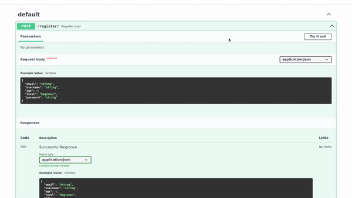
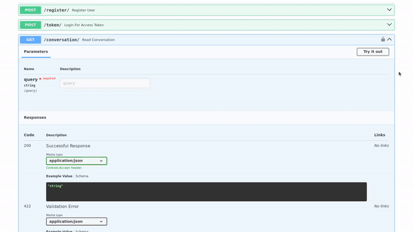

# CORS-based chatbot with JWT Auth

## Summary

Endpoint for a chatbot with an url allowed origin made with a CORS middleware and JWT authentication to ensure a secure endpoint. It also has an endpoint to create a user.

The chatbot is made with Langchain and OpenAI's model.

### /register/



### /conversation/



## Installation

This project is built using [poetry](https://python-poetry.org/). It is required its installation to be able to build correctly the environment.

To build, utilize your environmental variables in .env file, and then execute

```
poetry run main
```

and the access 

```
http://127.0.0.1:5555/docs
```

## What is JWT and how it works?

It is a Auth method that ables to contain all the information needed for authentication with no state needed.

Its structure is composed by:

- Header: Define the token encryption algorithm and the Auth type used.

- Payload: Contains the statements of the user

- Signature: It is what secures the token. It takes the encode data from the header and the payload using a secret key.

## Credits

Project idea by [Coding Crash Courses](https://www.youtube.com/@codingcrashcourses8533).